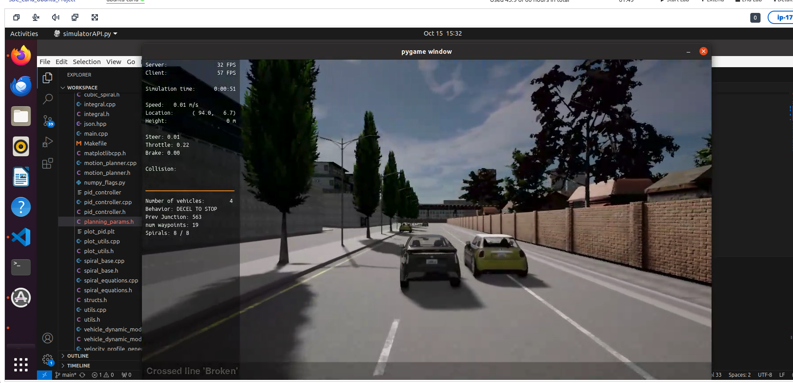
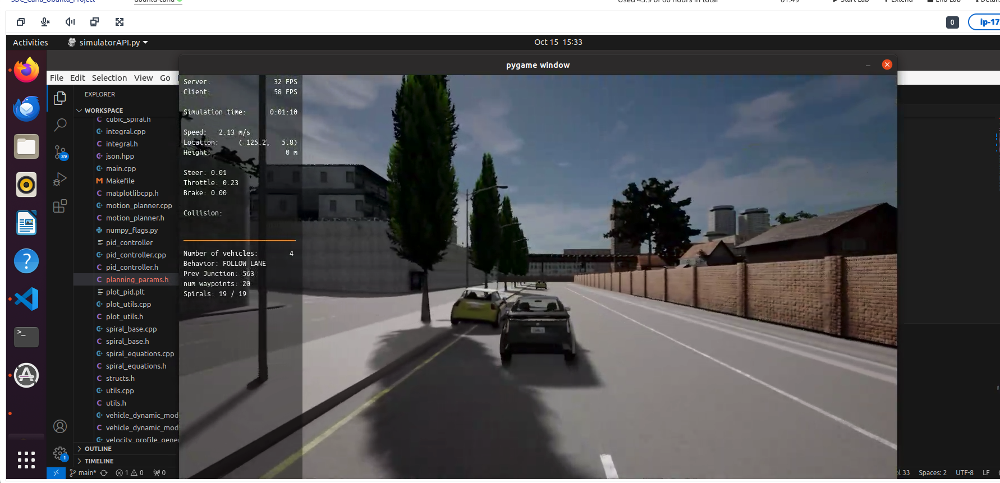
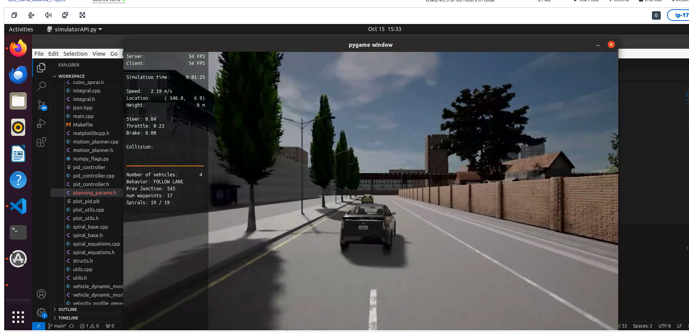
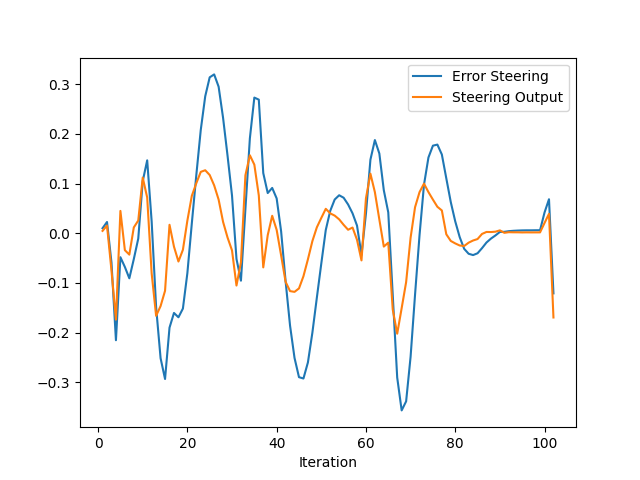
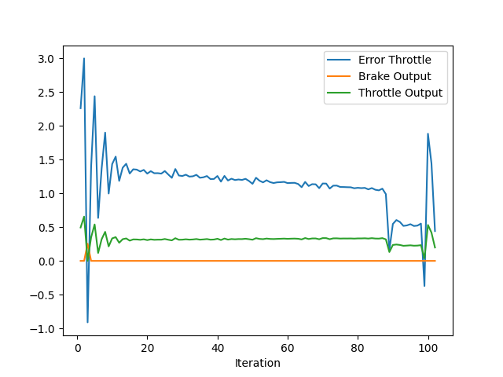

# Proportional-Integral-Derivative (PID)


## Project Instructions

In the previous project you built a path planner for the autonomous vehicle. Now you will build the steer and throttle controller so that the car follows the trajectory.

You will design and run the a PID controller as described in the previous course.

In the directory [/pid_controller](https://github.com/udacity/nd013-c6-control-starter/tree/master/project/pid_controller)  you will find the files [pid_controller.cpp](https://github.com/udacity/nd013-c6-control-starter/blob/master/project/pid_controller/pid_controller.cpp)  and [pid_controller.h](https://github.com/udacity/nd013-c6-control-starter/blob/master/project/pid_controller/pid_controller.h). This is where you will code your pid controller.
The function pid is called in [main.cpp](https://github.com/udacity/nd013-c6-control-starter/blob/master/project/pid_controller/main.cpp).

### Step 1: Build the PID controller object
Complete the TODO in the [pid_controller.h](https://github.com/udacity/nd013-c6-control-starter/blob/master/project/pid_controller/pid_controller.h) and [pid_controller.cpp](https://github.com/udacity/nd013-c6-control-starter/blob/master/project/pid_controller/pid_controller.cpp).

Run the simulator and see in the desktop mode the car in the CARLA simulator. Take a screenshot and add it to your report. The car should not move in the simulation.
### Step 2: PID controller for throttle:
1) In [main.cpp](https://github.com/udacity/nd013-c6-control-starter/blob/master/project/pid_controller/main.cpp), complete the TODO (step 2) to compute the error for the throttle pid. The error is the speed difference between the actual speed and the desired speed.

Useful variables:
- The last point of **v_points** vector contains the velocity computed by the path planner.
- **velocity** contains the actual velocity.
- The output of the controller should be inside [-1, 1].

2) Comment your code to explain why did you computed the error this way.

3) Tune the parameters of the pid until you get satisfying results (a perfect trajectory is not expected).

### Step 3: PID controller for steer:
1) In [main.cpp](https://github.com/udacity/nd013-c6-control-starter/blob/master/project/pid_controller/main.cpp), complete the TODO (step 3) to compute the error for the steer pid. The error is the angle difference between the actual steer and the desired steer to reach the planned position.

Useful variables:
- The variable **y_points** and **x_point** gives the desired trajectory planned by the path_planner.
- **yaw** gives the actual rotational angle of the car.
- The output of the controller should be inside [-1.2, 1.2].
- If needed, the position of the car is stored in the variables **x_position**, **y_position** and **z_position**

2) Comment your code to explain why did you computed the error this way.

3) Tune the parameters of the pid until you get satisfying results (a perfect trajectory is not expected).

### Step 4: Evaluate the PID efficiency
The values of the error and the pid command are saved in thottle_data.txt and steer_data.txt.
Plot the saved values using the command (in nd013-c6-control-refresh/project):

## Results:

PID coeffitients: **Kp**, **Kd**, **Ki**.

- **Kp** directly affected the error. High values apply a significant change and make the car oscillate when close to the desired path. The low value may cause the vehicle to run smoother, but it is hard to steer or throttle.

- **Kd** applies a counterforce opposite to the oscillations. This item is produced based on the error gradient, not the error itself. So Kd will flatten the error into a horizontal line.

- **Ki** increases with iterations and helps to reduce the error to zero. A high value will make the error smaller. When the error is stable, ki is needed to delete the error. 

Initialized PID parameters:

```python
pid_steer.Init(0.12, 0.0, 0.1, 1.2, -1.2);
pid_throttle.Init(0.20, 0.0015, 0.0, 1.0, -1.0);
```

The ego car autonomously in the CARLA simulator.
Left take over a car on the lane. 
     
Righ turn to avoid a parked car.
 
Proceeding on the lane.
 


### What is the effect of the PID according to the plots, how each part of the PID affects the control command?

|       Plot: PID Steering Errors        |       Plot: PID Throttle Errors        |
|:--------------------------------------:|:--------------------------------------:|
|  |  |

**Steering plot**: In the beginning, an oscillation with significant steering errors is kept along the ride by the iterations. The peaks are avoided obstacles on the road while always recovering to keep on track.

**Throttle plot**: In the beginning, a large oscillation with a significant throttle error due to the rapid starting acceleration decreases along the iterations to a smoother speed for safer obstacle avoidance.

### How would you design a way to automatically tune the PID parameters?
The Twiddle function is a way to tune the PID parameter automatically. Twiddle might be dangerous in a real-world self-driving vehicle application. Therefore, the traditional method is to measure the reaction signal of the hardware and calculate the mathematical representation to get a similar output signal, then tune a model.

### PID controller is a model free controller, i.e. it does not use a model of the car. Could you explain the pros and cons of this type of controller?

**Pros**: 
1. Not complex and simple to understand.
2. Car boundries are not considered.
3. Applicable to autonomous systems and vehicles.

**Cons**: 
1. The differential and integral factors make it non-linear for the changes.
2. One parameter affects the final result by a change in the other parameter.

### What would you do to improve the PID controller?
I would implement the Twiddle algorithm to improve by fine-tuning the PID controller.
